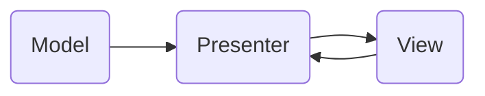

# Weather App
The weather app. It has three screens. The main screen shows the weather of your location. A screen showing your location on the map. And the third screen is weather search by city.


## Technologies

```sh
UIKit
```
```sh
Foundation
```
```sh
MVP
```
```sh
SnapKit
```
```sh
CoreLocation
```
```sh
MapKit
```

## MVP Architecture


## API Reference

#### Weather 5 day / 3 hour forecast data


```https
  GET: https://api.openweathermap.org/data/2.5/forecast?lat={lat}&lon={lon}&cnt={api_key}&units=metric
```

| Parameter | Type     | Description                |
| :-------- | :------- | :------------------------- |
|`lat`      | `string` | **Required**. Your API key |
|`lon`      |
|`api_key`  |
|`units=metric`|

#### City weather

```https
  GET: https://api.openweathermap.org/data/2.5/forecast?q={city}&limit=5&appid=api_key&units=metric
```

| Parameter | Type     | Description                       |
| :-------- | :------- | :-------------------------------- |
|`city`      | `string` | **Required**. Your API key |
|`api_key`  |
|`units=metric`|


## Appendix

Website with the Weather API

- [https://openweathermap.org]()


## Author

- [@danielLabetskiy](https://github.com/danyalabetski)


## Screenshots


